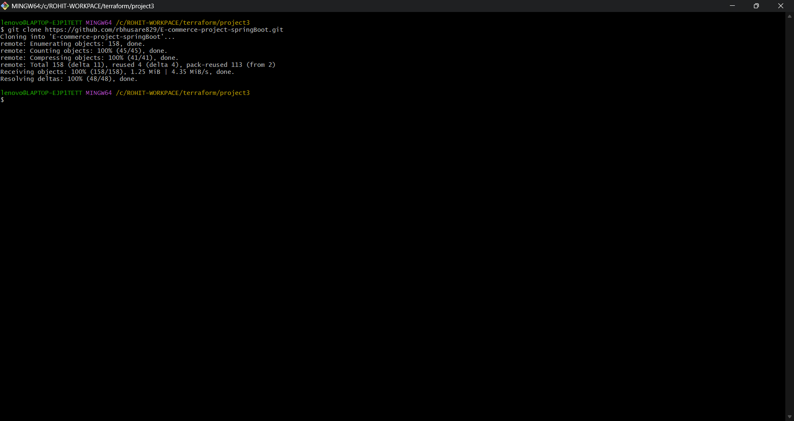
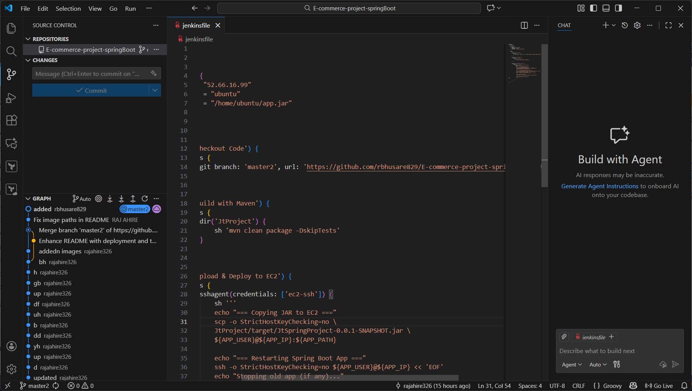
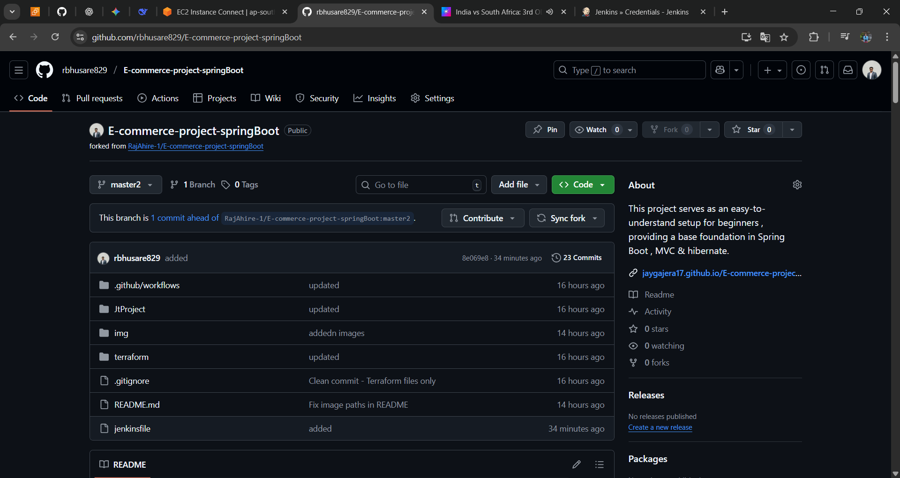
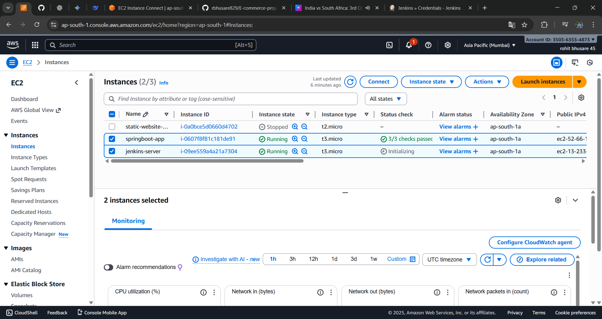
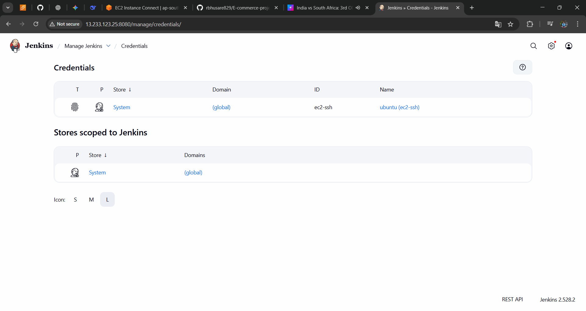

# 🚀 E-Commerce Spring Boot Application  
### CI/CD Deployment using **Terraform + AWS EC2 + RDS + Jenkins Pipeline**

This project demonstrates a full DevOps workflow where an **E-commerce Spring Boot application** is deployed automatically on AWS using **Terraform**, and new updates are continuously delivered using a **Jenkins CI/CD pipeline** connected to GitHub Webhooks.

---

## ✨ Tech Stack

| Layer | Technology |
|-------|------------|
| Backend | Spring Boot (Java 17), Maven |
| Infrastructure | Terraform (IAC) |
| Cloud | AWS EC2, RDS MySQL |
| CI/CD | Jenkins Pipeline |
| OS | Ubuntu 22.04 LTS |
| Git Integration | GitHub Webhooks |

---

## 🏗️ Architecture Workflow

```

Developer → GitHub Push
→ GitHub Webhook
→ Jenkins EC2 Server
→ Build & Package JAR
→ SCP to Application EC2
→ Start Spring Boot App
→ Connects to AWS RDS

```

---

## 📦 Infrastructure (Terraform)

Terraform provisions:

- EC2 instance for Jenkins  
- EC2 instance for Application  
- RDS MySQL Database  
- Key Pair  
- Security Groups  
- Subnet + Routing  
- Userdata script for auto-startup  

After deployment, Terraform outputs:

- **EC2 Public IP**
- **EC2 Public DNS**
- **RDS Endpoint**
- **Keypair Name**

---

## ⚙️ Jenkins Pipeline Flow

### Pipeline performs:

- Git Checkout from GitHub  
- Maven Build (`mvn clean package`)  
- SCP JAR to EC2  
- Stop old app  
- Start new JAR using `nohup`  
- Show success logs  

Trigger method → **GitHub Webhook**

---

## 🖼️ Screenshots (from `images/` folder)
### **1. Git colne**


---

### **2. VS Code – Project Structure**


---

### **3. Jenkins Console Output**


---

### **4. GitHub Repository**


---

### **5. AWS EC2 Dashboard**


---

### **6. Terraform Apply – Success**


---

### **7. Credentials Key**


---

## 🚀 How Deployment Works (Step-by-Step)

1. Developer pushes code → GitHub  
2. Webhook notifies Jenkins  
3. Jenkins pulls latest code  
4. Jenkins builds JAR with Maven  
5. Jenkins securely copies JAR to EC2  
6. Old app stops  
7. New JAR starts automatically  
8. App connects to RDS DB  
9. Deployment completes with zero manual effort  

---

## 📁 Important Files

| File | Purpose |
|------|---------|
| `JtProject/pom.xml` | Maven Build Configuration |
| `jenkinsfile` | CI/CD Pipeline Script |
| `main.tf` | Terraform Infrastructure |
| `variables.tf` | Input Variables |
| `outputs.tf` | Terraform Output |
| `userdata.sh.tpl` | App Autostart Script |

---

## 🔗 Access Application

After Terraform deploys:

```

http://<EC2_PUBLIC_IP>:8080/

```

---

## 🏁 Project Completed Successfully 🎉

This project showcases:

✔ Full CI/CD Automation  
✔ Zero-downtime Deployment  
✔ AWS Production Setup  
✔ Infrastructure as Code  
✔ Professional DevOps Workflow  

---

## 👨‍💻 Developed By  
**Rohit Bhusare**

